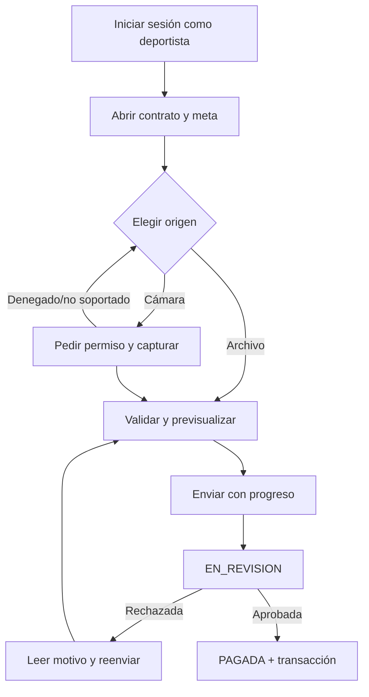
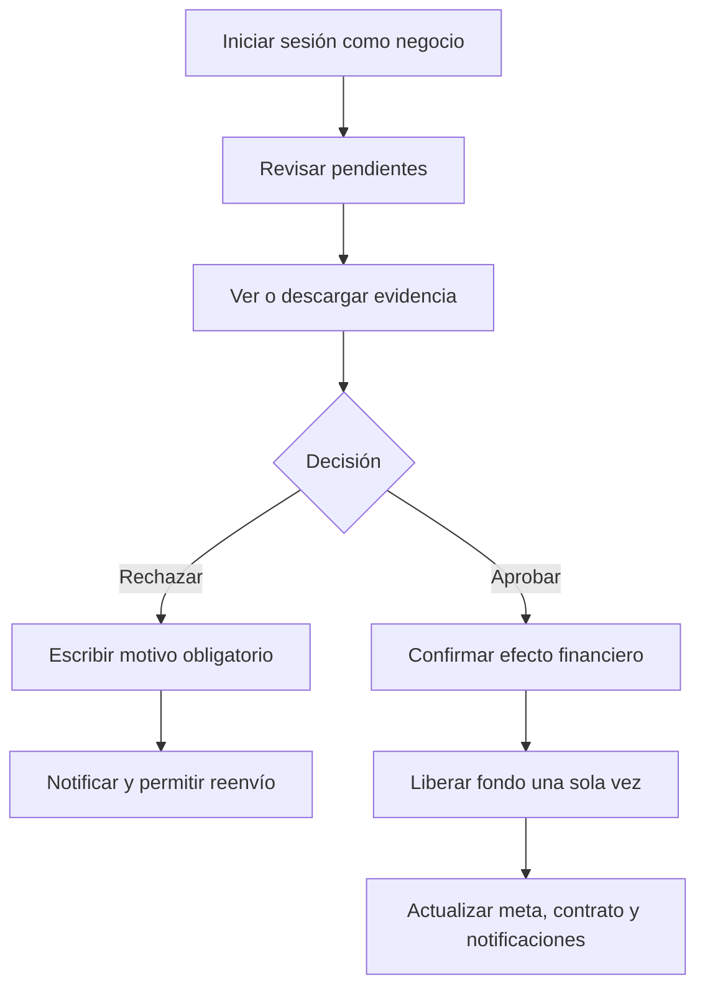

# Flujos de usuario

## Deportista

## Negocio

Las rutas públicas son `/`, `/marketplace`, `/login`, `/registro`; `/dashboard` requiere sesión. Las acciones se adaptan al rol devuelto por autenticación.
